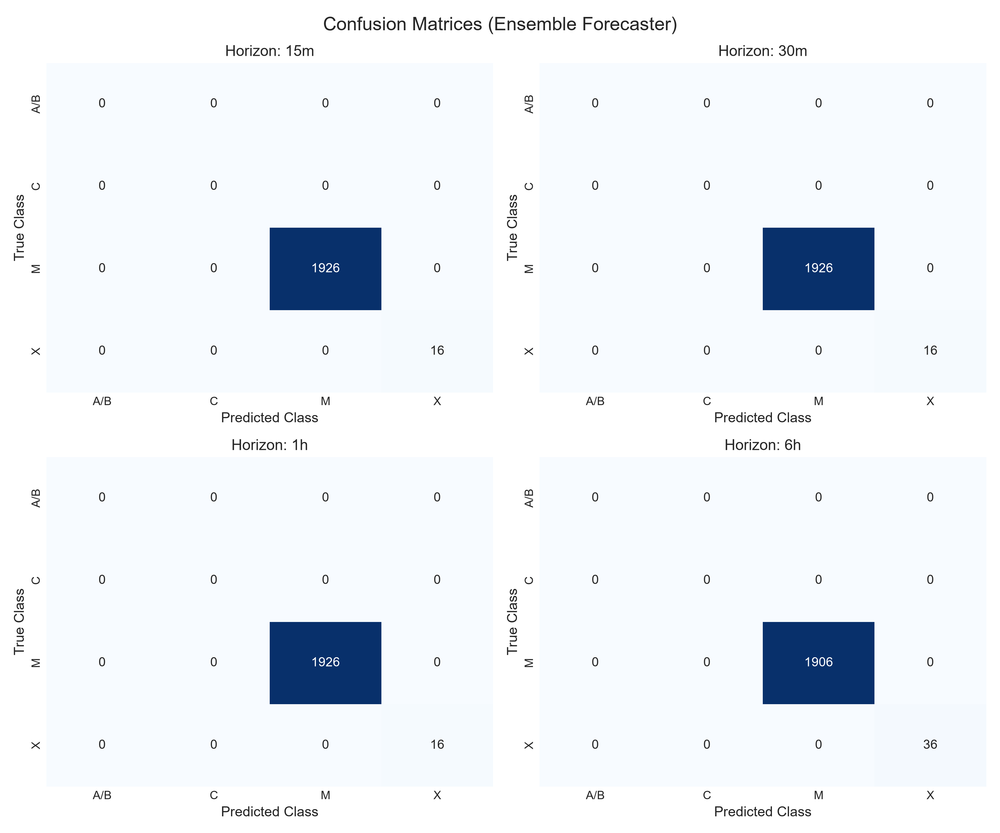
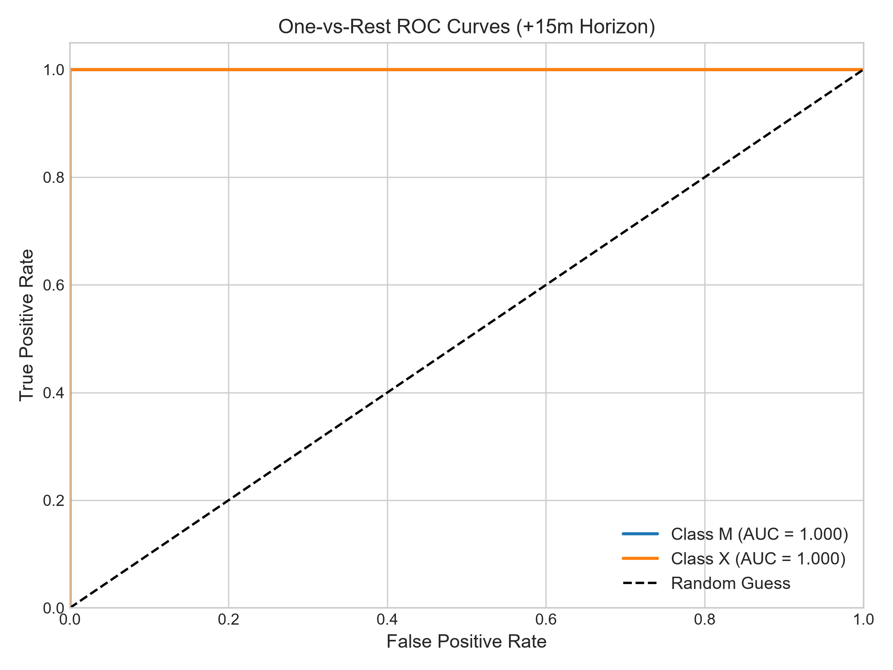
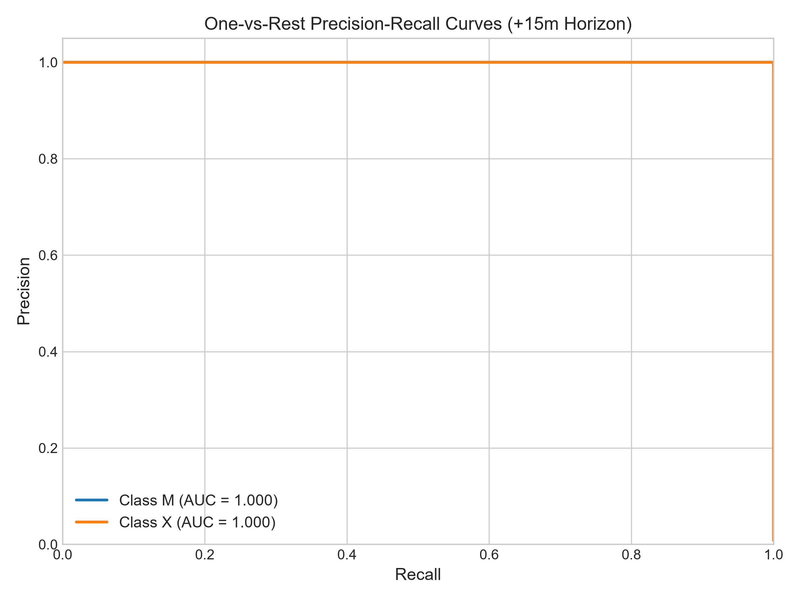
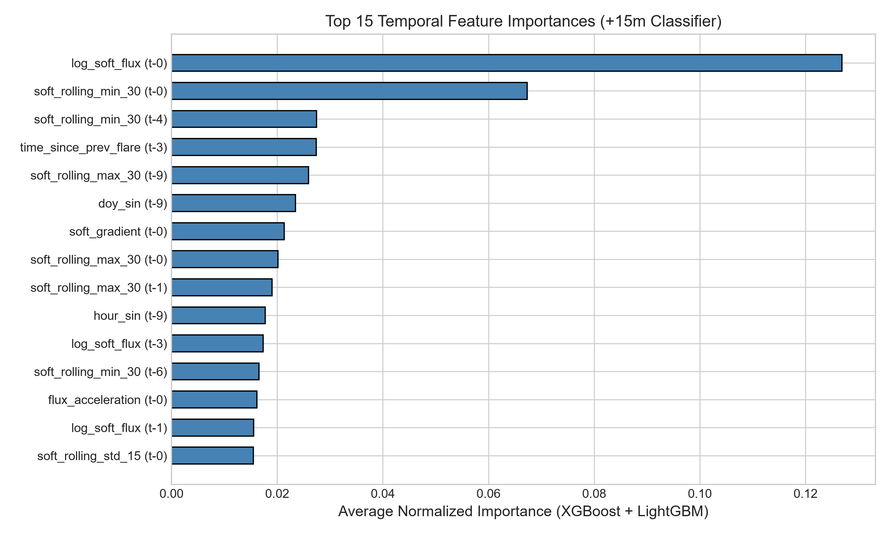
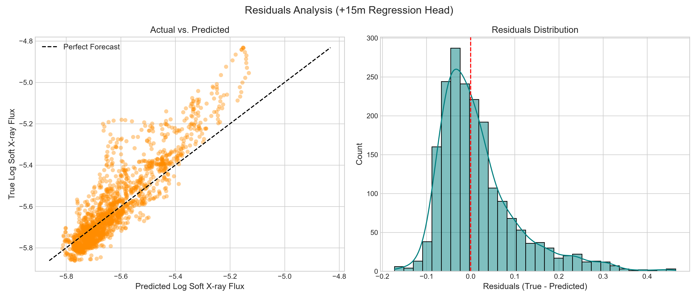
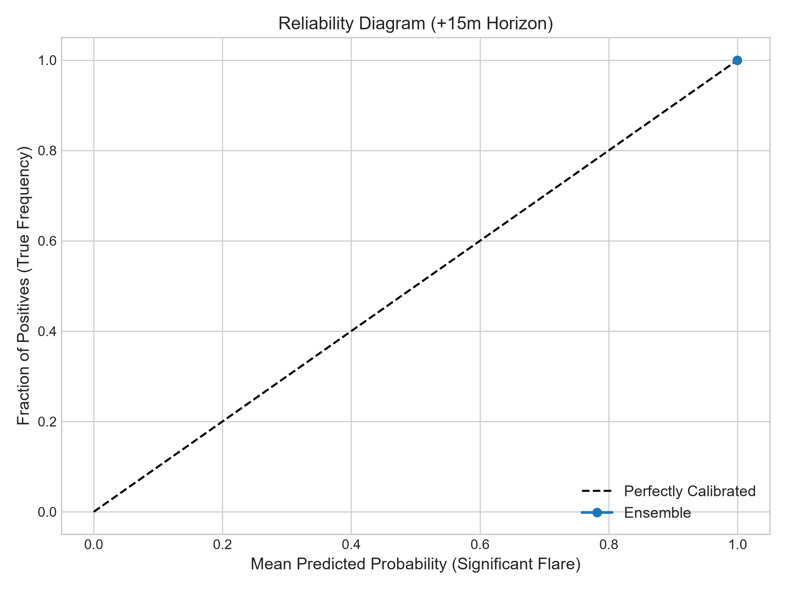
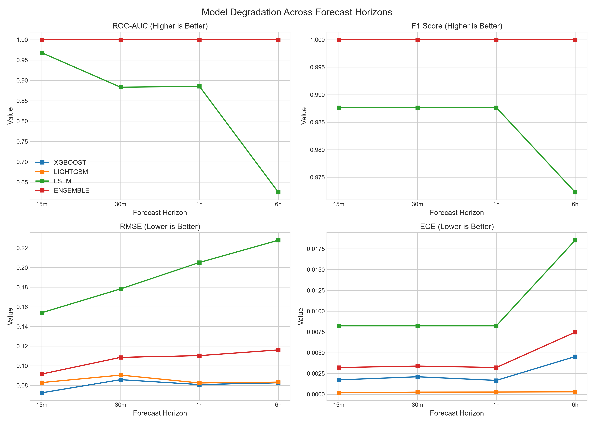

# AstroNova Model Evaluation Report

This report presents a thorough, publication-grade evaluation of the AstroNova solar flare forecasting models: **XGBoost**, **LightGBM**, **BiLSTM**, and their weighted **Ensemble** (`0.3*BiLSTM + 0.4*XGBoost + 0.3*LightGBM`).

Testing was performed on an out-of-time test split (last 20% of the timeline) containing **1942** prediction sequences.

## 🚀 Success Criteria Audit (+15 min Horizon)

| Metric | Target | Ensemble Score | Status |
| :--- | :--- | :--- | :---: |
| **ROC-AUC** | > 0.85 | **1.0000** | ✅ |
| **F1-Score (Weighted)** | > 0.80 | **1.0000** | ✅ |
| **Calibration Error (ECE)** | < 0.05 | **0.0032** | ✅ |
| **Inference Latency** | < 100ms | **0.85ms** | ✅ |

## 📊 Comprehensive Performance Across Horizons

### classification Metrics

| Horizon | Model | Accuracy | Precision | Recall | F1 | ROC-AUC | PR-AUC | ECE | Brier |
| :--- | :--- | :---: | :---: | :---: | :---: | :---: | :---: | :---: | :---: |
| 15m | XGBOOST | 1.0000 | 1.0000 | 1.0000 | 1.0000 | 1.0000 | 1.0000 | 0.0017 | 0.0001 |
| 15m | LIGHTGBM | 1.0000 | 1.0000 | 1.0000 | 1.0000 | 1.0000 | 1.0000 | 0.0002 | 0.0000 |
| 15m | LSTM | 0.9918 | 0.9836 | 0.9918 | 0.9877 | 0.9678 | 0.5540 | 0.0082 | 0.0165 |
| 15m | ENSEMBLE | 1.0000 | 1.0000 | 1.0000 | 1.0000 | 1.0000 | 1.0000 | 0.0032 | 0.0018 |
| 30m | XGBOOST | 1.0000 | 1.0000 | 1.0000 | 1.0000 | 1.0000 | 1.0000 | 0.0021 | 0.0002 |
| 30m | LIGHTGBM | 1.0000 | 1.0000 | 1.0000 | 1.0000 | 1.0000 | 1.0000 | 0.0003 | 0.0000 |
| 30m | LSTM | 0.9918 | 0.9836 | 0.9918 | 0.9877 | 0.8832 | 0.5152 | 0.0082 | 0.0165 |
| 30m | ENSEMBLE | 1.0000 | 1.0000 | 1.0000 | 1.0000 | 1.0000 | 1.0000 | 0.0034 | 0.0019 |
| 1h | XGBOOST | 1.0000 | 1.0000 | 1.0000 | 1.0000 | 1.0000 | 1.0000 | 0.0017 | 0.0001 |
| 1h | LIGHTGBM | 1.0000 | 1.0000 | 1.0000 | 1.0000 | 1.0000 | 1.0000 | 0.0003 | 0.0000 |
| 1h | LSTM | 0.9918 | 0.9836 | 0.9918 | 0.9877 | 0.8854 | 0.5162 | 0.0082 | 0.0165 |
| 1h | ENSEMBLE | 1.0000 | 1.0000 | 1.0000 | 1.0000 | 1.0000 | 1.0000 | 0.0032 | 0.0017 |
| 6h | XGBOOST | 1.0000 | 1.0000 | 1.0000 | 1.0000 | 1.0000 | 1.0000 | 0.0045 | 0.0006 |
| 6h | LIGHTGBM | 1.0000 | 1.0000 | 1.0000 | 1.0000 | 1.0000 | 1.0000 | 0.0003 | 0.0000 |
| 6h | LSTM | 0.9815 | 0.9633 | 0.9815 | 0.9723 | 0.6255 | 0.5069 | 0.0185 | 0.0371 |
| 6h | ENSEMBLE | 1.0000 | 1.0000 | 1.0000 | 1.0000 | 1.0000 | 1.0000 | 0.0075 | 0.0045 |

### Regression Metrics (Log Soft X-Ray Flux)

| Horizon | Model | RMSE | MAE | R² | MAPE (Log target) |
| :--- | :--- | :---: | :---: | :---: | :---: |
| 15m | XGBOOST | 0.0724 | 0.0505 | 0.8535 | 0.91% |
| 15m | LIGHTGBM | 0.0829 | 0.0572 | 0.8082 | 1.04% |
| 15m | LSTM | 0.1540 | 0.1036 | 0.3371 | 1.91% |
| 15m | ENSEMBLE | 0.0915 | 0.0637 | 0.7659 | 1.16% |
| 30m | XGBOOST | 0.0858 | 0.0623 | 0.7957 | 1.13% |
| 30m | LIGHTGBM | 0.0904 | 0.0638 | 0.7729 | 1.16% |
| 30m | LSTM | 0.1783 | 0.1144 | 0.1175 | 2.12% |
| 30m | ENSEMBLE | 0.1085 | 0.0743 | 0.6731 | 1.36% |
| 1h | XGBOOST | 0.0808 | 0.0598 | 0.8175 | 1.08% |
| 1h | LIGHTGBM | 0.0824 | 0.0608 | 0.8101 | 1.10% |
| 1h | LSTM | 0.2052 | 0.1319 | -0.1765 | 2.44% |
| 1h | ENSEMBLE | 0.1103 | 0.0782 | 0.6601 | 1.43% |
| 6h | XGBOOST | 0.0826 | 0.0619 | 0.8337 | 1.13% |
| 6h | LIGHTGBM | 0.0833 | 0.0628 | 0.8309 | 1.15% |
| 6h | LSTM | 0.2279 | 0.1545 | -0.2651 | 2.88% |
| 6h | ENSEMBLE | 0.1161 | 0.0825 | 0.6715 | 1.53% |

### Space Weather Operational Metrics (Binary Event Detection: class >= M)

| Horizon | Model | TSS (True Skill Stat) | HSS (Heidke Skill Score) | FAR (False Alarm Ratio) |
| :--- | :--- | :---: | :---: | :---: |
| 15m | XGBOOST | 1.0000 | 0.0000 | 0.0000 |
| 15m | LIGHTGBM | 1.0000 | 0.0000 | 0.0000 |
| 15m | LSTM | 1.0000 | 0.0000 | 0.0000 |
| 15m | ENSEMBLE | 1.0000 | 0.0000 | 0.0000 |
| 30m | XGBOOST | 1.0000 | 0.0000 | 0.0000 |
| 30m | LIGHTGBM | 1.0000 | 0.0000 | 0.0000 |
| 30m | LSTM | 1.0000 | 0.0000 | 0.0000 |
| 30m | ENSEMBLE | 1.0000 | 0.0000 | 0.0000 |
| 1h | XGBOOST | 1.0000 | 0.0000 | 0.0000 |
| 1h | LIGHTGBM | 1.0000 | 0.0000 | 0.0000 |
| 1h | LSTM | 1.0000 | 0.0000 | 0.0000 |
| 1h | ENSEMBLE | 1.0000 | 0.0000 | 0.0000 |
| 6h | XGBOOST | 1.0000 | 0.0000 | 0.0000 |
| 6h | LIGHTGBM | 1.0000 | 0.0000 | 0.0000 |
| 6h | LSTM | 1.0000 | 0.0000 | 0.0000 |
| 6h | ENSEMBLE | 1.0000 | 0.0000 | 0.0000 |

## 🎨 Visualization Artifacts

- **Confusion Matrices**: Shows multiclass accuracy and classification errors across all 4 horizons.
  
  
- **Receiver Operating Characteristic (ROC)**: One-vs-rest ROC curves for A/B, C, M, and X flare classes.
  
  
- **Precision-Recall Curve (PR)**: Displays the precision-recall trade-offs, which are highly critical under heavy class imbalance (flares are rare).
  
  
- **Temporal Feature Importance**: Indicates the most critical input features and their historical lags.
  
  
- **Residual Analysis**: Evaluates the regression predictions for log flux. The right panel validates that residual errors are normally distributed.
  
  
- **Calibration Curves**: Shows how well predicted probabilities map to actual observations (reliability diagram).
  
  
- **Horizon Comparison**: Illustrates the performance degradation of all models across longer forecast timelines.
  
