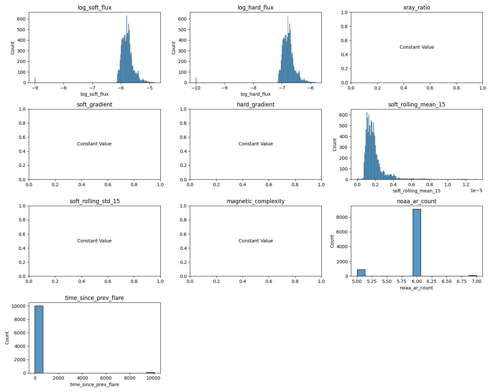
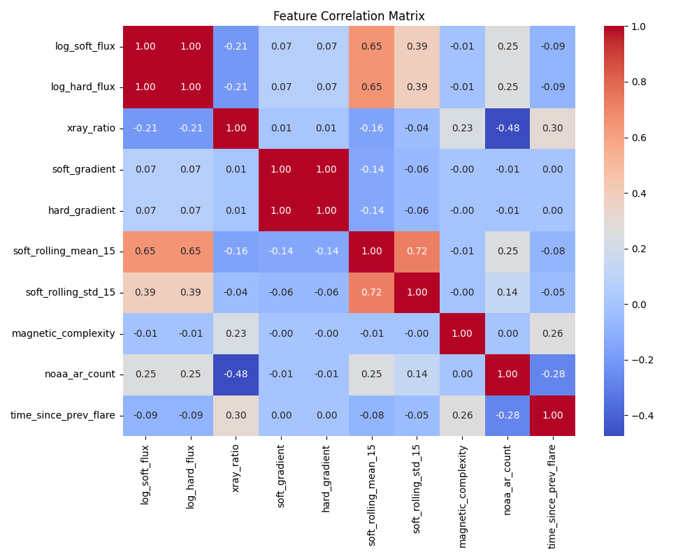
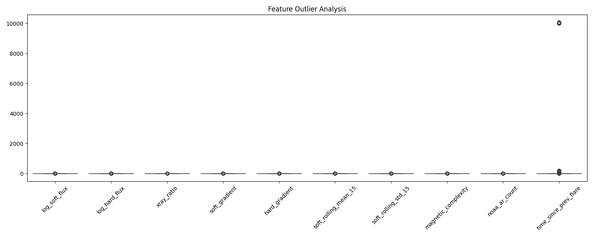

# Feature Engineering Verification

## Feature Statistics
```text
              Feature  NaN Count  Inf Count          Mean          Std           Min           Max
        log_soft_flux          0          0 -5.785252e+00 2.925170e-01 -9.000000e+00 -4.832172e+00
        log_hard_flux          0          0 -6.785252e+00 2.925170e-01 -1.000000e+01 -5.832172e+00
           xray_ratio          0          0  1.000000e+01 1.677910e-15  1.000000e+01  1.000000e+01
        soft_gradient          0          0  1.496173e-10 1.130672e-07 -1.328737e-06  1.809246e-06
        hard_gradient          0          0  1.496173e-11 1.130672e-08 -1.328737e-07  1.809246e-07
 soft_rolling_mean_15          0          0  1.911002e-06 1.230419e-06  0.000000e+00  1.317639e-05
  soft_rolling_std_15          0          0  1.544926e-07 2.690270e-07  0.000000e+00  3.387341e-06
  magnetic_complexity          0          0  5.000000e+00 1.097981e-16  5.000000e+00  5.000000e+00
        noaa_ar_count          0          0  5.923596e+00 3.043088e-01  5.000000e+00  7.000000e+00
time_since_prev_flare          0          0  8.108930e+01 8.796228e+02  0.000000e+00  1.007700e+04
```

## Checks
- Missing expected features: None ✅
- Features with NaNs: []
- Features with Infs: []

## Visualizations
- 
- 
- 

*Generated by verify_features.py*
