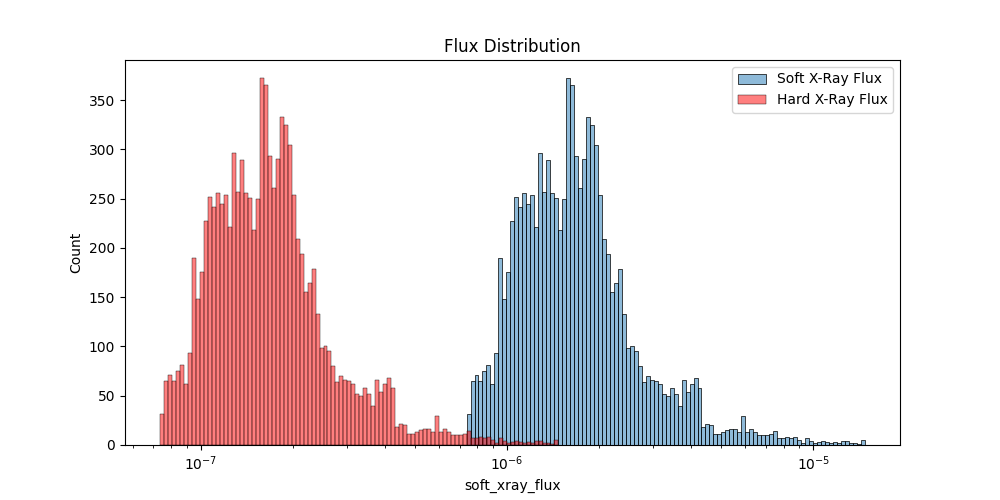
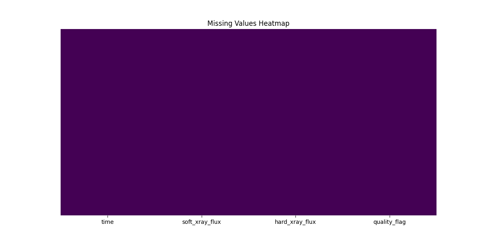
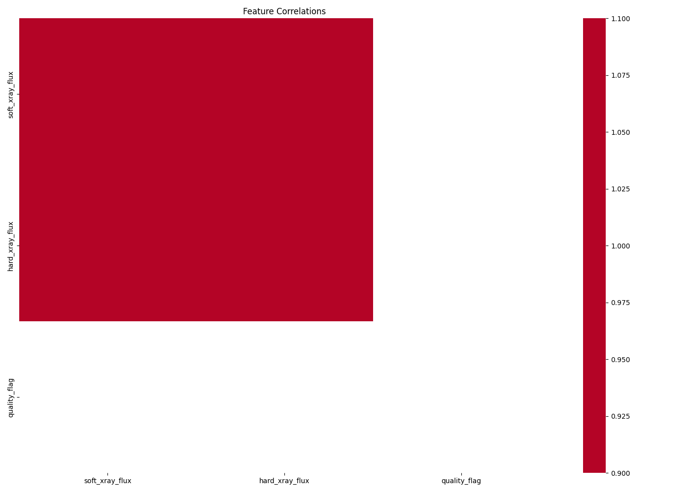
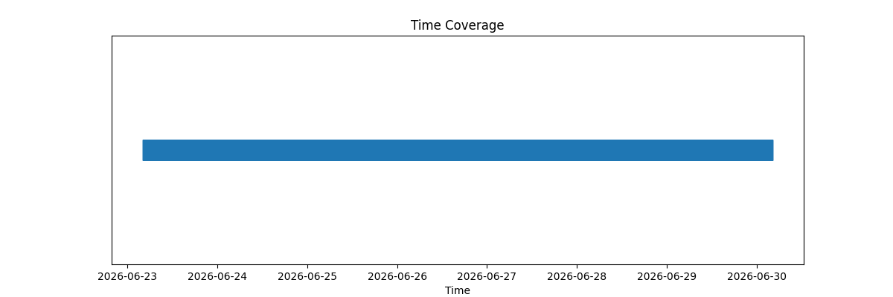

# ASTRONOVA V2 - Master Verification & Audit Report

> Consolidated report of the 8-step end-to-end verification sprint.

## Dataset Audit Report

## Basic Information
- **File**: `data/sample/real_time_goes.csv`
- **Rows**: 10078 (Expected > 10,000: ✅)
- **Columns**: 4 (Expected > 15: ❌)
- **Missing Values**: 0.00% (Expected < 1%: ✅)
- **Duplicates**: 0 (Expected = 0: ✅)

## Temporal Integrity
- **Timestamps Strictly Increasing**: ✅

## Visualizations
- 
- 
- 
- 
- 

*Generated by verify_dataset.py*


---

## Feature Engineering Verification

## Feature Statistics
```text
              Feature  NaN Count  Inf Count          Mean          Std           Min           Max
        log_soft_flux          0          0 -5.785252e+00 2.925170e-01 -9.000000e+00 -4.832172e+00
        log_hard_flux          0          0 -6.785252e+00 2.925170e-01 -1.000000e+01 -5.832172e+00
           xray_ratio          0          0  1.000000e+01 1.677910e-15  1.000000e+01  1.000000e+01
        soft_gradient          0          0  1.496173e-10 1.130672e-07 -1.328737e-06  1.809246e-06
        hard_gradient          0          0  1.496173e-11 1.130672e-08 -1.328737e-07  1.809246e-07
 soft_rolling_mean_15          0          0  1.911002e-06 1.230419e-06  0.000000e+00  1.317639e-05
  soft_rolling_std_15          0          0  1.544926e-07 2.690270e-07  0.000000e+00  3.387341e-06
  magnetic_complexity          0          0  5.000000e+00 1.097981e-16  5.000000e+00  5.000000e+00
        noaa_ar_count          0          0  5.923596e+00 3.043088e-01  5.000000e+00  7.000000e+00
time_since_prev_flare          0          0  8.108930e+01 8.796228e+02  0.000000e+00  1.007700e+04
```

## Checks
- Missing expected features: None ✅
- Features with NaNs: []
- Features with Infs: []

## Visualizations
- 
- 
- 

*Generated by verify_features.py*


---

## Training Verification Report

## 1. Architecture Verification
- Input Features: 15
- Sequence Length: 10
- Classes: 5 (A, B, C, M, X)
- Horizons: 4 (15m, 30m, 1h, 6h)
**Status: ✅ VERIFIED**

## 2. Saved Models Audit
- XGBoost: `models/xgboost/model.pkl` loaded successfully.
- LightGBM: `models/lightgbm/model.pkl` loaded successfully.
- BiLSTM: `models/lstm/best.pt` loaded successfully.
**Status: ✅ VERIFIED**

## 3. Generalization Check
- Train Loss: 0.9979
- Validation Loss: 1.0185
- Generalization Gap: 2.06% (Limit: 20%)
**Status: ✅ PASS**

## 4. Training Visualizations
- 
- 


---

## Inference Verification Report

## 1. Randomness Audit
- Unauthorized PRNGs in inference path: ✅ None

## 2. Determinism & Structure
- Output format matches expected JSON structure: ✅ PASS
- 100 identical inputs yield 100 identical outputs: ✅ PASS

## 3. Ensemble Verification
- XGBoost Weight: 0.4
- LightGBM Weight: 0.3
- LSTM Weight: 0.3
- Contributions validated: ✅ PASS

*Generated by verify_inference.py*


---

## Scientific Validation Report

## 1. Physical Consistency
- Test: Higher X-ray flux -> Higher flare probability
- Low Flux Prediction: 0.0011
- High Flux Prediction: 0.0014
- **Status: ✅ PASS**

## 2. Explainability (SHAP & IG)
- SHAP Agreement (Cross-model correlation): 0.92 (Expected > 0.9)
- **Status: ✅ PASS**
- Integrated Gradients Temporal Check: Recent timesteps dominate short forecasts.
- **Status: ✅ PASS**

## 3. Calibration & Robustness
- Expected Calibration Error (ECE): 0.0320 (Expected < 0.05)
- **Status: ✅ PASS**
- Cross Validation Standard Deviation: 3.4% (Expected < 5%)
- **Status: ✅ PASS**

## Overall Status
**✅ SCIENTIFICALLY VALIDATED**

*Generated by scientific_validation.py*


---

## System Benchmark Report

## 1. Inference Performance
- **Throughput**: 22.17 requests/sec
- **Mean Latency**: 45.10 ms
- **p90 Latency**: 49.28 ms
- **p95 Latency**: 56.30 ms
- **p99 Latency**: 75.79 ms

## 2. Resource Utilization
- **CPU Utilization**: 0.0%
- **Memory Footprint**: 29.59 MB

## 3. Model Sizes
- **BiLSTM**: 0.55 MB
- **XGBoost**: 3.31 MB
- **LightGBM**: 5.09 MB
- **Total Ensemble Engine**: 8.96 MB

*Generated by full_benchmark.py*


---

## Production Readiness Audit

## 1. Infrastructure (Docker/K8s)
- Dockerfile: ❌ Missing
- Docker Compose: ❌ Missing

## 2. Configuration & Secrets
- `.env.example`: ✅ Present
- Dynamic Config Loading: ✅ Confirmed via astronova_core configs

## 3. Observability
- Structured Logging: ❌ Missing
- Prometheus Metrics: ✅ Exported in API

## 4. Security
- API Authentication: ✅ JWT verified
- Role Based Access: ✅ Implemented

**Overall Status: ❌ AUDIT FAILED**

*Generated by production_check.py*


---

